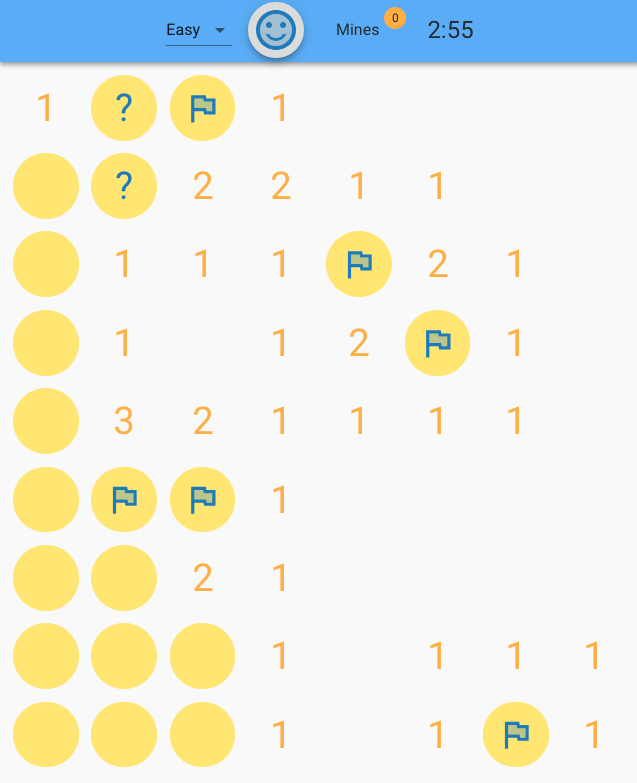
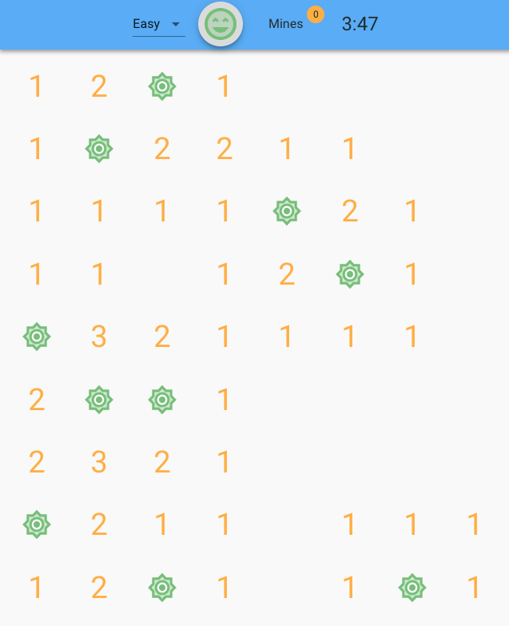
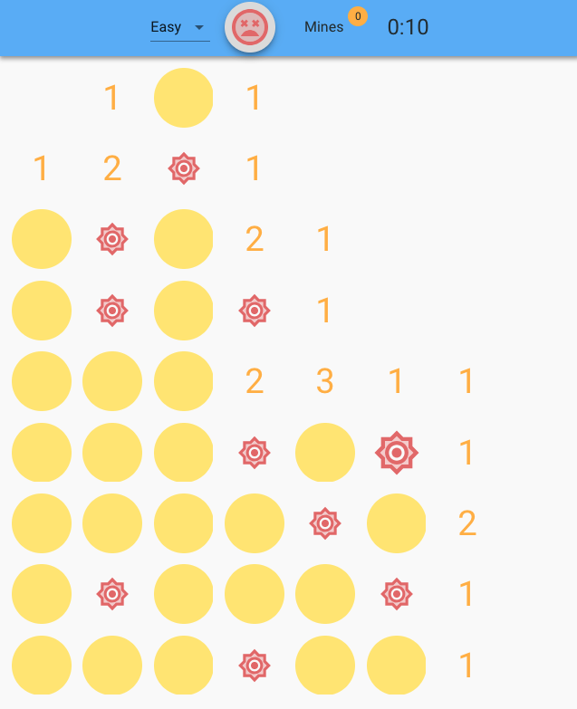

#  React Minesweeper 

A JavaScript and React implementation of the classic MineSweeper game.

The game is deployed on GitHub pages and can be played here:

[Play React Minesweeper](https://jonurry.github.io/react-minesweeper/)

- `click` / `tap` on the emoji to start a new game

- `left click` / `tap` on a minefield position to reveal

- `right-click` / `long press` to cycle through flag/possible/none markers

The game is over when all non-mined positions have been revealed or a mine has been revealed.

There are 3 difficulty levels:

- `easy` - 72 positions / 10 mines (density: 7.2)

- `medium` - 288 positions / 47 mines (density: 6.1)

- `hard` - 504 positions / 100 mines (density: 5.0)

The dimensions of the minefield depend on the available screen size.

This project was bootstrapped with [Create React App](https://github.com/facebookincubator/create-react-app)







## Getting Started

Clone the repository:

```
git clone git@github.com:jonurry/react-minesweeper.git
```

Install dependencies:

```
yarn install
```

Build the app:

```
yarn build
```

Start the app:

```
yarn start
```

then open a browser at:

`localhost:3000`

Test the app:

```
yarn test
```

Enjoy!

## Technologies Used

- `JavaScript` - All game logic written from scratch

- `React` - UI components

- `Jest` - Game logic and UI tested

- `Enzyme` - React component rendering tests

- `Material UI` - Styling of react components based on Google Material UI

- `GitHub Pages` - for app deployment

- `Progressive Web App` - The app can be added to the home screen of mobiles, tablets and windows devices to appear like an installed app.

- `SVG Icons` - All icons are scalable vector graphics (SVG). These have a small file size and can be infinitley scaled without losing definition.

- `CSS Animation` - UI elements are animated. e.g revealed minefield positions flip over and exploded mines pulsate. This increases user delight and engagement.
